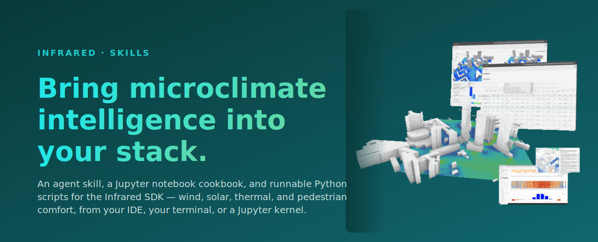

<p align="center">
  <a href="https://infrared.city/">
    
  </a>
</p>

<p align="center">
  <a href="https://infrared.city/"><b>infrared.city</b></a>
  &nbsp;·&nbsp;
  <a href="https://infrared.city/simulations/">Simulations</a>
  &nbsp;·&nbsp;
  <a href="https://infrared.city/knowledge-base/">Knowledge base</a>
  &nbsp;·&nbsp;
  <a href="#install-the-skill">Install the skill</a>
  &nbsp;·&nbsp;
  <a href="cookbook/">Cookbook</a>
</p>

---

> **What this is.** Two ways to use the [Infrared SDK](https://infrared.city/docs/sdk) without leaving the tools you already have:
>
> 1. An **agent skill** that teaches Claude Code, Cursor, Codex CLI, GitHub Copilot, and Windsurf how to drive the SDK and read its results.
> 2. A **Jupyter cookbook** that walks through every analysis end-to-end with embedded outputs.
>
> Pick one. They share the same SDK, the same auth, the same conventions.

## What you can simulate

The Infrared SDK runs eight microclimate analyses on any polygon you give it:

| Analysis | Output |
|---|---|
| Wind speed | m/s grid |
| Pedestrian wind comfort (Lawson LDDC) | class 0–4 grid |
| Solar radiation | kWh/m² grid |
| Daylight availability | hours grid |
| Direct sun hours | hours grid |
| Sky view factor | 0–1 grid |
| Thermal comfort (UTCI) | °C grid |
| Thermal comfort statistics | hours per UTCI band |

Polygons can span one tile or many — the SDK fans out, runs jobs concurrently, and merges results.

## What you can fetch

Run an analysis with what's already on the ground, or use the same layers in your own pipeline:

| Layer | Format |
|---|---|
| Buildings | DotBim mesh + per-building heights |
| Trees / vegetation | Gridded canopy heights |
| Ground materials | Gridded surface-class IDs |
| Weather | Filtered EPW-style hourly fields |

Layers are populated worldwide from OpenStreetMap-class sources; coverage and freshness vary by region.

## Install the skill

The agent skill lives at `plugins/infrared/skills/use-infrared/`. It's a [Claude Code plugin](https://docs.claude.com/en/docs/claude-code/plugins) and a [Cursor 2.5+ plugin](https://docs.cursor.com/) — same content, twin manifests.

### Claude Code

```text
/plugin marketplace add Infrared-city/infrared-skills
/plugin install infrared@infrared-skills
```

### Cursor

```text
/plugin marketplace add Infrared-city/infrared-skills
/plugin install infrared@infrared-skills
```

### Codex CLI / GitHub Copilot / Windsurf

These read `AGENTS.md` from the project root. Either clone this repo into your workspace, or copy `plugins/infrared/skills/use-infrared/` into your project's `.agents/skills/` directory.

The skill loads progressively — `SKILL.md` is an 80-line router that the agent reads first, then it pulls per-topic references from `references/` only when needed (analysis specs, async/webhook patterns, error handling, geometry, weather, etc.).

## Run the cookbook

Two flavours under [`cookbook/`](cookbook/), both auto-synced from the SDK:

- [`cookbook/notebooks/`](cookbook/notebooks/) — eight pre-executed Jupyter notebooks against five preset cities (Munich, New York, São Paulo, Tokyo, Sydney). Standalone, runnable in any order. Cells ship with embedded outputs from a real run — flip through without executing to see exactly what the SDK produces.
- [`cookbook/scripts/`](cookbook/scripts/) — runnable `.py` examples covering wind, UTCI, multi-analysis, vegetation/ground, tiling, fetch-layers, and the async + webhook lifecycle.

```bash
git clone git@github.com:Infrared-city/infrared-skills.git
cd infrared-skills/cookbook/notebooks   # or cookbook/scripts
python -m venv .venv && source .venv/bin/activate
pip install -r requirements.txt
cp .env.example .env   # paste your INFRARED_API_KEY
jupyter lab            # for the notebooks
```

## SDK access

Request an API key at <https://infrared.city>, then install the SDK from PyPI:

```bash
pip install infrared-sdk
export INFRARED_API_KEY=...
```

Full SDK reference: <https://infrared.city/docs/sdk>.

## Learn more

- **About the platform** — <https://infrared.city/>
- **What the simulations do** — <https://infrared.city/simulations/>
- **Validation, methods, model docs** — <https://infrared.city/knowledge-base/>
- **SDK docs** — <https://infrared.city/docs/sdk>

## Layout

```
infrared-skills/
├── plugins/infrared/skills/use-infrared/   # the agent skill
│   ├── SKILL.md                            # 80-line router
│   └── references/                         # per-topic deep-dives
├── cookbook/                               # 8 Jupyter notebooks (auto-mirrored from SDK)
├── AGENTS.md                               # for Codex / Copilot / Windsurf
└── docs/assets/                            # README artwork
```

## License

Apache-2.0. See [`LICENSE`](LICENSE).
