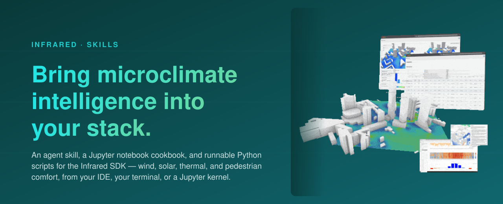
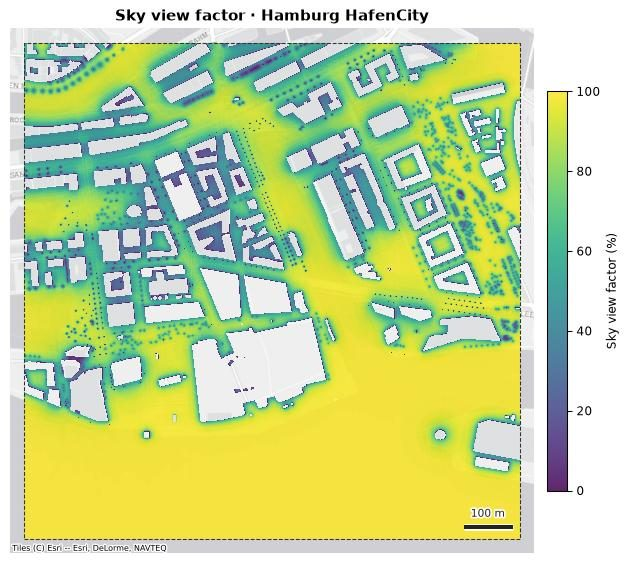
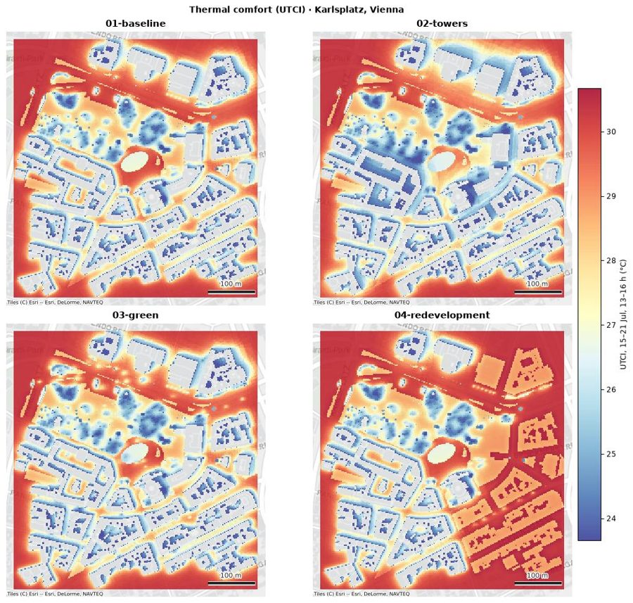
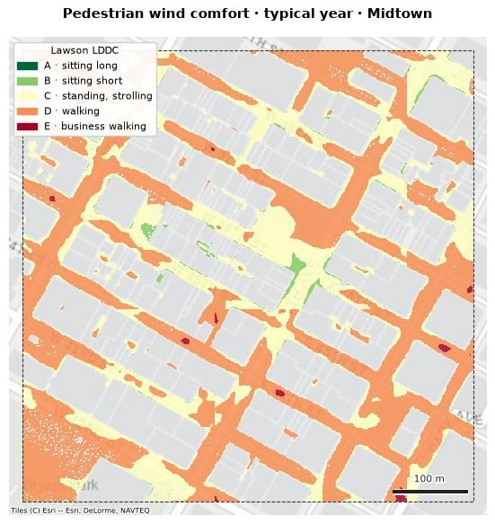
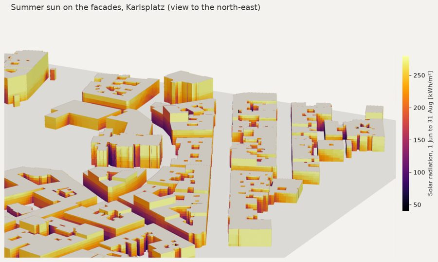
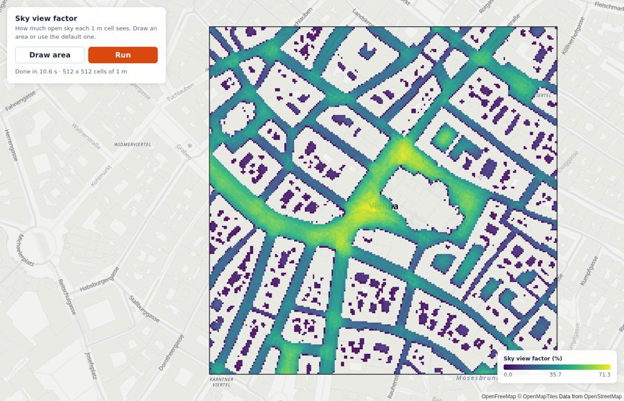
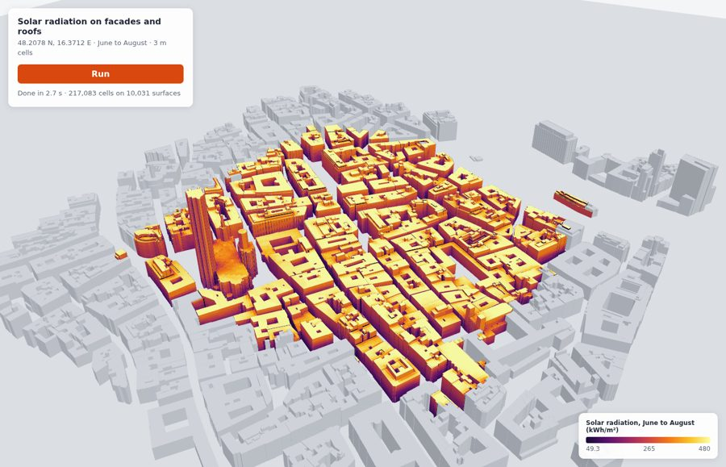
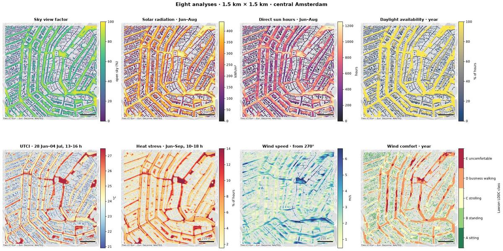

<p align="center">
  <a href="https://infrared.city/">
    
  </a>
</p>

<p align="center">
  <a href="https://infrared.city/"><b>infrared.city</b></a> &nbsp;·&nbsp;
  <a href="https://infrared.city/docs/sdk/">SDK docs</a> &nbsp;·&nbsp;
  <a href="#try-it-in-five-minutes">Try it</a> &nbsp;·&nbsp;
  <a href="#install-the-plugin">Install</a> &nbsp;·&nbsp;
  <a href="#what-do-you-want-to-build">Router</a> &nbsp;·&nbsp;
  <a href="#cookbook">Cookbook</a>
</p>

<p align="center">
  
  <a href="https://pypi.org/project/infrared-sdk/"></a>
  <a href="https://www.npmjs.com/package/@infrared-city/infrared-sdk"></a>
</p>

---

## New in 1.0

- **SDK 1.0, Python and TypeScript.** The skill and every example use `infrared-sdk` 1.0 and `@infrared-city/infrared-sdk` 1.0. The TypeScript package was `@infrared-city/infrared-sdk-ts` before 1.0.1; use the new name. The notebooks, scripts and apps ran against the live API.
- **Start from your goal.** A router sends you to the right path: Grasshopper, notebook, web app, app for many users, or backend.
- **Ten case-study notebooks.** Real sites, basemaps, 3D facades, design variants. Your own model first, public data as the fallback.
- **Web apps in minutes.** A map with a Run button, a 3D facade viewer, and a Cloudflare Worker that keeps your API key secret. Plus a FastAPI backend.
- **Fast by design.** One page on how to get the most speed: upload once, let the SDK poll, preview first, threads and workers, what one account can do.
- **Grasshopper, rewritten.** A non-blocking component, fast mesh drawing and facade textures.
- **Docs for agents.** The skill links to <https://infrared.city/docs/sdk/> and its `llms.txt`, so agents read the current API.

Using SDK 0.5.x? Use branch [`sdk-0.5.x`](https://github.com/Infrared-city/infrared-skills/tree/sdk-0.5.x). See [Compatibility](#compatibility).

## What this is

Tools to build with the [Infrared SDK](https://infrared.city/docs/sdk/) (urban microclimate: wind, sun, daylight, thermal comfort).

1. An **agent skill** (`use-infrared`). It teaches your coding agent the SDK in Python and TypeScript, for scripts, web apps, and Grasshopper.
2. A **cookbook**. Notebooks, scripts, and small apps. Each one answers one question about a real site.

The skill links to the docs site for API detail. It does not copy it.

## Try it in five minutes

You need an API key from <https://infrared.city>. Set it once: `export INFRARED_API_KEY=...`

**Ask your coding agent.** Install the plugin (next section). Then ask, for example:

- "Make a map of the sky view factor around Karlsplatz, Vienna."
- "Build me a small web app: I draw an area, press Run, and see thermal comfort on a map."
- "Write a Grasshopper component that shows summer sun on my facades."

**Run a notebook.**

```bash
git clone https://github.com/Infrared-city/infrared-skills && cd infrared-skills/cookbook/notebooks
pip install -r requirements.txt
jupyter lab 00_quickstart.ipynb
```

**Run a web app.**

```bash
cd infrared-skills/cookbook/apps/map-grid   # from the folder where you cloned the repo
npm install && npm run dev
```

Each run shows its cost first (a free preview). One small area is about 10 tokens.

## Install the plugin

**Claude Code** and **Cursor**:

```text
/plugin marketplace add Infrared-city/infrared-skills
/plugin install infrared@infrared-skills
```

**Codex CLI, GitHub Copilot, Windsurf**: these read [`AGENTS.md`](AGENTS.md). Clone this repo into your workspace. Or copy `plugins/infrared/skills/use-infrared/` into your project's `.agents/skills/` folder.

Get an API key at <https://infrared.city>. Set it as `INFRARED_API_KEY`. Never put it in code.

## What do you want to build?

| Goal | SDK | Go to |
|---|---|---|
| Grasshopper or Rhino component | Python in Rhino 8 | [grasshopper](plugins/infrared/skills/use-infrared/references/recipes/grasshopper.md), [geometry and drawing](plugins/infrared/skills/use-infrared/references/recipes/grasshopper-geometry-and-drawing.md), [pitfalls](plugins/infrared/skills/use-infrared/references/recipes/grasshopper-pitfalls.md) |
| Analysis, study or notebook for yourself | Python | [python/quickstart](plugins/infrared/skills/use-infrared/references/python/quickstart.md), [00_quickstart](cookbook/notebooks/00_quickstart.ipynb) |
| Web app for yourself (browser, map, 3D facades) | TypeScript in the browser | [typescript/quickstart](plugins/infrared/skills/use-infrared/references/typescript/quickstart.md), [map-grid](plugins/infrared/skills/use-infrared/references/typescript/map-grid.md), [facades-3d](plugins/infrared/skills/use-infrared/references/typescript/facades-3d.md), [apps/map-grid](cookbook/apps/map-grid), [apps/facades-3d](cookbook/apps/facades-3d) |
| Web app for many users (sign-in, secret key) | TypeScript front end + Cloudflare Worker proxy | [cloudflare-proxy](plugins/infrared/skills/use-infrared/references/typescript/cloudflare-proxy.md), [apps/cloudflare-proxy](cookbook/apps/cloudflare-proxy), [persistence-and-users](plugins/infrared/skills/use-infrared/references/recipes/persistence-and-users.md) |
| High-throughput backend (many sites, queue, cache) | Python service | [python-fastapi-app](plugins/infrared/skills/use-infrared/references/recipes/python-fastapi-app.md), [apps/python-fastapi](cookbook/apps/python-fastapi) |
| SketchUp or other CAD plugin | Ruby or Python, same API | [sketchup-plugin](plugins/infrared/skills/use-infrared/references/recipes/sketchup-plugin.md) |
| Upload your own data to the platform (no code) | none | [platform-byo-upload](plugins/infrared/skills/use-infrared/references/platform-byo-upload.md) |

## Cookbook

Each notebook uses your own model first. Public data (Overture) is the fallback. Preview a run before you send it: the preview is free.

| | |
|---|---|
| [](cookbook/notebooks/00_quickstart.ipynb) | [](cookbook/notebooks/01_design_variants.ipynb) |
| **00 quickstart**: sky view factor on a basemap | **01 design variants**: four scenarios compared on thermal comfort |
| [](cookbook/notebooks/03_wind_comfort.ipynb) | [](cookbook/notebooks/04_solar_facades_3d.ipynb) |
| **03 wind comfort**: Lawson classes for a dense area | **04 solar facades 3D**: summer sun on every wall |
| [](cookbook/apps/map-grid) | [](cookbook/apps/facades-3d) |
| **apps/map-grid**: draw an area, press Run, see the map | **apps/facades-3d**: facades and roofs in 3D in the browser |

[](cookbook/notebooks/09_all_analyses.ipynb)

**09 all analyses**: eight area analyses on 1.5 km × 1.5 km of Amsterdam, sent in one call

- [`cookbook/notebooks/`](cookbook/notebooks/): ten case studies, 00 to 09.
- [`cookbook/scripts/`](cookbook/scripts/): three short Python scripts.
- [`cookbook/apps/`](cookbook/apps/): runnable web apps and a Python backend.
- [`cookbook/sample-data/`](cookbook/sample-data/): GeoJSON models for the examples.

See [`cookbook/README.md`](cookbook/README.md) for how to run them.

## Docs for agents

- Guide: <https://infrared.city/docs/sdk/>
- The whole guide as one Markdown file: <https://infrared.city/docs/sdk/sdk.md>
- Page index: <https://infrared.city/docs/sdk/llms.txt> and <https://infrared.city/docs/sdk/1.0/llms.txt>
- Each page also exists as Markdown: add `index.md` to its URL.

## Compatibility

| Plugin | Python SDK | TypeScript SDK | Branch |
|---|---|---|---|
| 1.0.x | `infrared-sdk` 1.0.x | `@infrared-city/infrared-sdk` 1.0.1+ (was `@infrared-city/infrared-sdk-ts` 1.0.0) | `main` |
| 0.3.x | `infrared-sdk` 0.5.x | none | `sdk-0.5.x` (tag `sdk-0.5.x-final`, frozen) |

## Layout

```
infrared-skills/
├── plugins/infrared/skills/use-infrared/   # the agent skill (SKILL.md + references/)
├── cookbook/                               # notebooks, scripts, apps, sample data
├── AGENTS.md                               # for Codex, Copilot, Windsurf
└── docs/assets/                            # README artwork
```

## License

Apache-2.0. See [`LICENSE`](LICENSE).
