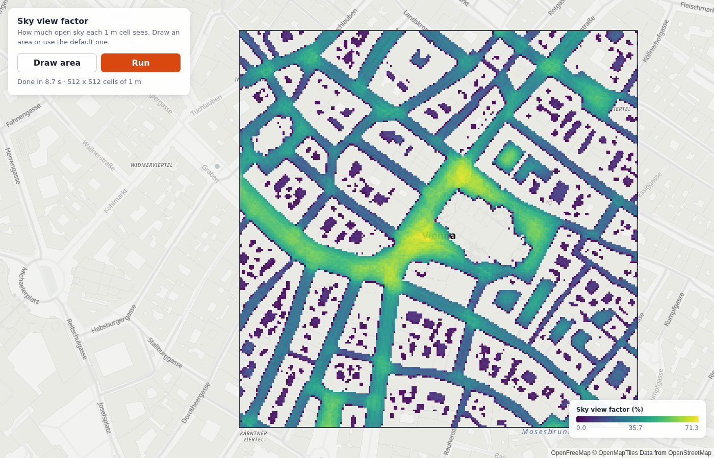

# Cloudflare proxy: keep the API key off the browser

A Cloudflare Worker that serves your built app and proxies the Infrared API.
The API key is a Worker secret. The browser never sees it.



## Run it

1. Build an app and install: `(cd ../map-grid && npm install && npm run build) && npm install`
2. Put the key in `.dev.vars` (git-ignored): `INFRARED_API_KEY=...`
3. `npx wrangler dev` and open <http://localhost:8787>. Press **Run**.

Deploy: `npx wrangler secret put INFRARED_API_KEY`, then `npx wrangler deploy`.

## What the Worker does

| Path | Goes to | Notes |
|---|---|---|
| `/api/ir/*` | `https://api.infrared.city/v2/*` | Only the routes the SDK calls (`API_ROUTES` in `src/proxy.ts`); all others get 403. Adds `X-Api-Key`. Drops `Authorization`, cookies, `Origin`. |
| `/api/s3/<host>/<key>` | `https://<host>/<key>` | Result download only. GET/HEAD, results bucket only, no key. |
| everything else | the static app (`assets`) | `run_worker_first` sends only `/api/*` to the Worker. |

Why the relay: the result of a job is a presigned storage URL on another origin.
That bucket sends no CORS headers, so the browser blocks the download. The relay
forwards it with no credential (the URL carries its own signature). The geometry
**upload** goes straight to storage: that bucket allows it. Never relay any host:
an open relay is an open proxy.

## Browser client

```ts
import { relayUrl } from "./proxy";  // copy of src/proxy.ts, or your own rewrite
const client = new InfraredClient({
  baseUrl: `${location.origin}/api/ir`,
  auth: async () => ({}),            // no credential in the browser; the proxy signs
  fetch: (input, init) => fetch(input instanceof Request ? input : relayUrl(String(input)), init),
});
```

`InfraredClient` needs a credential option: without `apiKey`, `token`, `getToken`
or `auth` the constructor throws. An `auth` that returns no header is accepted.

## Protection

The proxy spends **your** key for every visitor that it lets through. These
layers decide who gets through:

- **Route allowlist** (`API_ROUTES` in `src/proxy.ts`): only the calls the SDK makes
  for upload, submit, status, result download and pricing. Account, key and billing
  routes get 403. When a new SDK version calls a new route, add it there.
- **Origin check** (`src/proxy.ts`): a POST must come from the Worker's own origin or
  from `ALLOWED_ORIGINS`. This stops other web pages. It does not stop scripts: a
  script can send any `Origin`.
- **Rate limit** (`RUN_LIMITER` in `wrangler.jsonc`): 60 write calls per minute per
  client IP. A run of N tiles makes about 2 N write calls (upload URL + submit), so
  set the limit above 2 x the tiles of your largest run.
- **Your sign-in check**: for a public app, check the user's session in
  `src/worker.ts` before `handleProxy`, and key the rate limit on the user, not the IP.
  This is the real protection of your token budget.

## Files

| File | What it does |
|---|---|
| `src/proxy.ts` | The proxy (Web `Request`/`Response` only). The Vite dev servers of the apps use it too. |
| `src/worker.ts` | Rate limit, your sign-in check, then `handleProxy`, else the static app. |
| `wrangler.jsonc` | Assets folder, `ALLOWED_ORIGINS`, rate limit binding. |
