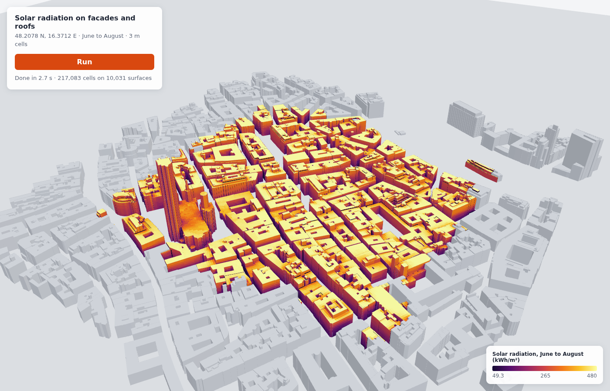

# Facades 3D: solar radiation on facades and roofs

three.js viewer. It runs solar radiation (June to August) with
`analysisSurfaces: "all"` and draws every facade and roof cell in its own colour.
Move the pointer over a wall to see the value of that cell.

## Run it

1. `npm install`
2. `export INFRARED_API_KEY=...` (or put it in a `.env` file here; it is git-ignored)
3. `npm run dev` and open the URL. Press **Run** (the default site is 1 job, about 10 tokens).

Change the site with `?lon=..&lat=..` in the URL. The panel shows the jobs, sensors and
tokens before you run. A facade run bills per building batch, so the app uses
`previewAreaBatches`, not `previewArea`.

## How the drawing works

`surfaceRenderBuffers(columns)` gives flat arrays, not a mesh for each cell
([format](https://infrared.city/docs/sdk/1.0/#what-the-render-buffers-are)):

- Each **frame** is one flat wall or roof part with a grid of `nu` x `nv` cells.
- `outline` holds the triangles of each frame in cell units `(s, t)`.
- A vertex is at `anchor + corner + s * uStep + t * vStep`.
- The cell under a point is `k = cellStart + floor(t) * nu + floor(s)`.
- `values[k]` is the value (f16 bits or f32). Bit `k & 7` of `validity[k >> 3]` says if it has one.

`src/surface-mesh.ts` builds one `BufferGeometry` from the outline (attributes
`position`, `cell`, `frame`). The fragment shader finds cell `k` and reads its value
from a texture (`R16F` for f16, no conversion). So one draw call shows every cell
with its exact colour. The mesh sits at `anchor`, so the f32 positions stay small.

| File | What it does |
|---|---|
| `src/main.ts` | Core start, client, buildings and weather, preview, Run, hover. |
| `src/surface-mesh.ts` | Render buffers → three.js mesh + shader. Also `cellIndex`, `cellIsValid`. |
| `src/context-mesh.ts` | All buildings as one grey mesh. |
| `src/ramp.ts` | A colour ramp and the HTML legend. |

Checked against the raw result: the cell values, the validity bits and the frame
positions of `surfaceRenderBuffers` agree with `surfaceValuesF32`, `surfaceHasValue`
and the surface origins and axes of the columns. Frames sit on the building meshes.

## Notes

- Buildings, the result and the scene use one frame: metres from the polygon's
  south-west corner, x east, y north, z up (`camera.up = (0, 0, 1)`).
- Sensors go on the target buildings of each tile the polygon touches, not only
  inside the polygon. The preview shows the true sensor and job count.
- The result download goes through the proxy relay (`/api/s3/...`); the geometry
  upload goes straight to storage. See [`../cloudflare-proxy`](../cloudflare-proxy/).
- Your own buildings: pass your `{ id: { coordinates, indices } }` map as `buildings`.
