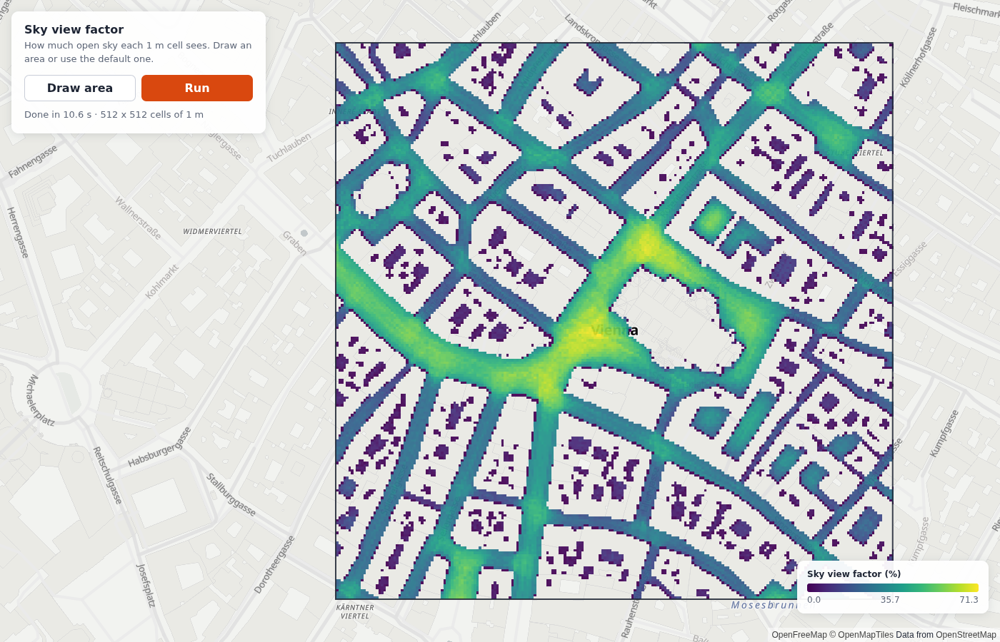

# Map grid: sky view factor on a map

MapLibre (light basemap) + deck.gl `BitmapLayer`. Draw an area or use the default
one in central Vienna. The panel shows the tiles, jobs and tokens before you run.
Press **Run** to get the sky view factor of each 1 m ground cell.

## Run it

1. `npm install`
2. `export INFRARED_API_KEY=...` (or put it in a `.env` file here; it is git-ignored)
3. `npm run dev` and open the URL. Press **Run** (one tile is about 10 tokens).

The Vite dev server is the proxy: it adds the key on the server side. The browser
bundle does not contain the key. For production, see [`../cloudflare-proxy`](../cloudflare-proxy/).

Do not start the dev server with `--host`. The dev server holds the real key; on
the network, a foreign page can pass its `Origin` check.

## Files

| File | What it does |
|---|---|
| `src/main.ts` | Core start, client, map, draw tool, preview, Run. |
| `src/grid-image.ts` | `areaGridValuesF32` → coloured canvas. Flips the rows (row 0 = south). |
| `src/ramp.ts` | A viridis ramp and the HTML legend. |
| `vite.config.ts` | Dev server + the proxy from `../cloudflare-proxy/src/proxy.ts`. |

## Rules this app follows

- `initializeCore({ url })` once, before any SDK call. Vite gives the WASM URL:
  `import coreUrl from "@infrared-city/infrared-sdk-ts/core.wasm?url"`.
- `new InfraredClient({ baseUrl: "/api/ir" on your origin, auth: async () => ({}), fetch })`.
  The empty `auth` means "the proxy signs". The `fetch` sends the result download
  through the proxy relay, because the results bucket sends no CORS headers.
- `client.previewArea(polygon, { analysisType })` is free and local. Show it before Run.
- Read values with `areaGridValuesF32(result)` (NaN = no value), never `mergedGrid`.
- Row 0 of the grid is the south edge. Place the image with `result.bounds` = `[west, south, east, north]`.
- Your own buildings: pass `{ id: { coordinates, indices } }` (metres, origin = the
  south-west corner of the polygon) as `buildings`. The app reads public buildings
  only as the fallback.

Other analyses: change `ANALYSIS`. Weather analyses (solar radiation, UTCI) also need
weather input; see [`../facades-3d/src/main.ts`](../facades-3d/src/main.ts) and the
[docs](https://infrared.city/docs/sdk/1.0/#weather-and-time-period).
