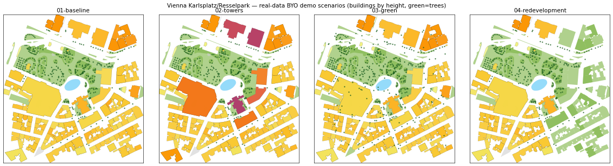

# Vienna Karlsplatz — real-data BYO demo set

Real open data for **Vienna, Karlsplatz / Resselpark** (~450 m block: Karlskirche,
Musikverein, TU Wien, the park with the Mooreteich pond), shaped into **four
visibly different scenarios** you drag onto the Infrared platform
(platform.infrared.city) → **New project → "Bring your own data"**.



Unlike the synthetic `../platform-upload/` set (rectangles — fine for the
validators, unconvincing on a map), every footprint, tree, and surface here is
the real thing. Generated by
[`cookbook/scripts/demo_vienna_scenarios.py`](../../scripts/demo_vienna_scenarios.py);
the file contract lives in the `use-infrared` skill reference
[`platform-byo-upload.md`](../../../plugins/infrared/skills/use-infrared/references/platform-byo-upload.md).

## What's in each scenario

| Scenario | Buildings | Trees | Surfaces | What changed (obvious on the map) |
|---|---|---|---|---|
| `01-baseline` | 123 (real heights) | 362 (real species) | 75 (park, pond, plazas) | the real block, untouched |
| `02-towers` | 123, **8 towers ×3 height** (up to 66 m) | 362 | 75 | eight blocks shoot up into towers |
| `03-green` | 123 | **500** (dense new planting, varied species) | 75, **all paving → vegetation** | the whole ground turns to park + trees |
| `04-redevelopment` | **66** (eastern third cleared) | 362 | 145 (cleared footprints → park) | half the buildings gone, replaced by green |

All four share the **same site bbox** so they line up when compared. Counts stay
inside the platform caps (buildings ≤ 50 000, trees ≤ 500, surfaces ≤ 500), and
each file was validated against the platform's own parsers with **zero
fallbacks, zero defaulted materials, zero dropped features** (see below).

## Folder layout — what to drop where

```
vienna-demo/
  scenarios/
    01-baseline/         buildings.geojson  trees.geojson  surfaces.geojson
    02-towers/           …
    03-green/            …
    04-redevelopment/    …
  create-with-variants/  buildings/trees/surfaces.geojson
                         variant-towers.geojson  variant-redevelopment.geojson
  weather/               (EPWs are NOT committed — see weather/README.md for the
                          download URLs; the ~/Downloads copy has them inline)
```

Each file is **one data layer**; a multi-file drop is auto-classified by content
(points → trees, material-tagged polygons → surfaces, other polygons → buildings,
`.epw` → weather).

### Demo script

1. **One scenario as a project** — drop a `scenarios/01-baseline/` folder (its 3
   files) onto the create card. The site is derived from the geometry; run any
   analysis.
2. **Baseline + variants in one drop** — drop everything in
   `create-with-variants/` at once. Baseline lands on its rows; the two extra
   buildings-like files (`variant-towers`, `variant-redevelopment`) become
   **design-variant scenarios** automatically.
3. **Compare scenarios** — add `02-towers` / `03-green` / `04-redevelopment` as
   scenarios (add-scenario form or the Data-layers panel), then compare.
4. **"Madrid's climate in Vienna"** — drop `weather/madrid.epw` on a scenario's
   **weather** row and re-run: the Vienna geometry now uses Madrid's TMY climate.
   `weather/vienna.epw` is the local baseline.

## Data sources & attribution

| Layer | Source | Licence |
|---|---|---|
| Buildings, ground surfaces | OpenStreetMap via [Overpass API](https://overpass-api.de) | © OpenStreetMap contributors, [ODbL](https://opendatacommons.org/licenses/odbl/) |
| Trees (species, height, crown) | [Stadt Wien – Baumkataster](https://www.data.gv.at/) (`ogdwien:BAUMKATOGD`) | [CC BY 4.0](https://creativecommons.org/licenses/by/4.0/) — *Datenquelle: Stadt Wien – data.wien.gv.at* |
| Weather (EPW) | [climate.onebuilding.org](https://climate.onebuilding.org) TMYx | see [weather/README.md](weather/README.md) |

If you redistribute derivatives, keep the OSM/ODbL and Stadt Wien attributions.

## Regenerate / relocate

```bash
# default = this Karlsplatz block, fetches EPWs into ./vienna-demo/weather/
python cookbook/scripts/demo_vienna_scenarios.py

# a different area (S W N E, WGS84) and no weather download
python cookbook/scripts/demo_vienna_scenarios.py --bbox 48.20 16.36 48.21 16.38 --no-epw
```

OSM is live, so a regenerate reflects current mapping. The committed files are a
snapshot taken + validated on 2026-07-03.

## Validation

Every file was fed through the platform's actual upload parsers on
`forge-kit@origin/staging` (2026-07-03): content classification, per-layer deep
validation (`prepareBuildingsUpload` / `prepareTreesUpload` /
`prepareMaterialsUpload`), and the real EPW parse — all accepted, buildings
`meshesOut == featuresIn`, `fallbackApplied == 0`, `defaultedMaterials == []`,
`droppedOutside == 0` for every scenario.
